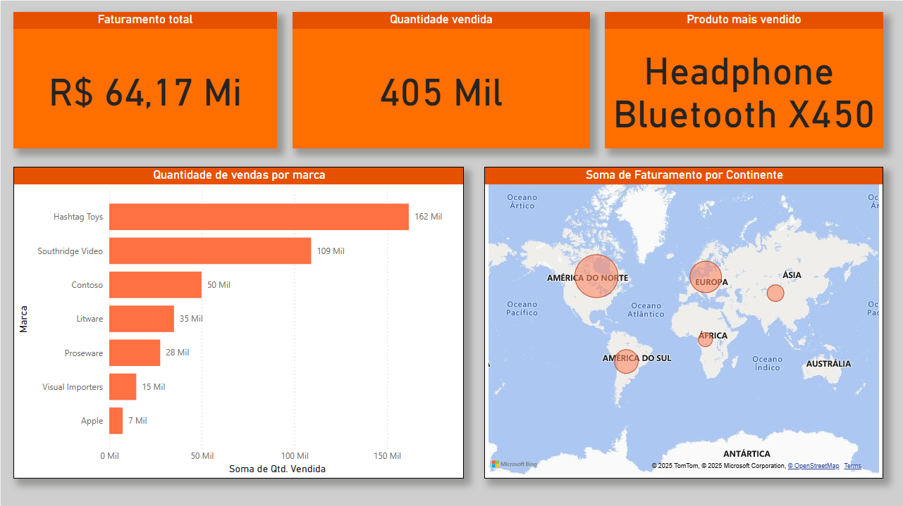

# 📊 Dashboard de Vendas – Power BI

Este projeto apresenta uma análise completa de dados de vendas globais utilizando o **Power BI**, com visual moderno, responsivo e insights acionáveis.

---

## 🗂️ Arquivos Incluídos

- `vendas_dashboard.pbix` – Arquivo do Power BI com o dashboard finalizado
- `Dados_Vendas_2024.xlsx` – Base de dados utilizada
- `/imagens/dashboard_geral.png` – Captura de tela da página principal do dashboard

---

## 📈 Principais Insights

A página principal do relatório traz os seguintes destaques:

- **Faturamento Total:** R$ 64,17 milhões
- **Quantidade Vendida:** 405 mil unidades
- **Produto Mais Vendido:** Headphone Bluetooth X450
- **Análise de Marcas:** Vendas por fabricante com destaque para Hashtag Toys e Southridge Video
- **Faturamento por Continente:** Visualização geográfica interativa com destaque para América do Norte e Europa

---

## 🧰 Ferramentas Utilizadas

- **Power BI Desktop**
- **Microsoft Excel** (para modelagem e simulação de dados)

---

## 🖼️ Captura de Tela

---

## 📌 Estrutura do Dashboard

- **Página 1 – Visão Geral:** KPIs principais, mapa de faturamento por continente, gráfico de vendas por marca

